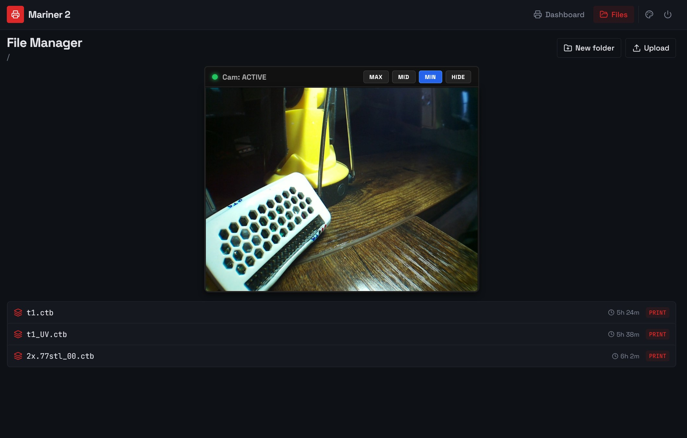
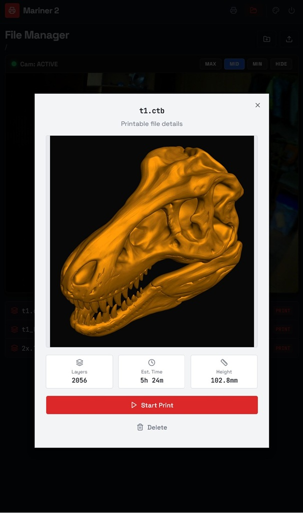

# Mariner 2 Cam
### 3D-Printer Monitoring Tool with Camera Support + OTG-USB-Gadget, Firewall, VPN, Fail2ban and Webmin installation

**Status:** Work-in-progress, but working stable and fine now. I went through all the steps in my guide again from a fresh install to prove it.

>**Chitobox-Note:** The code from amd989 had to be modified a bit to work on new `.ctb` files (is it a bug or caused by a Chitobox update?).

---

* **GitHub-Project:** [frittna/mariner2cam](https://github.com)
* **Last Changes:** 17:53 - 03.June.2026

#### Project History (Forks)
* This project is a fork from [Mariner 2 (amd989)](https://github.com)
* Which was a fork from [Mariner (luizribeiro)](https://github.com)

---

### 📖 Complete Installation Guide & Code

The full step-by-step guide for a Zero 2 W including can be found here:
You can run it yourself by following this tutorial (in German at the moment).

➡️ **[Click here to view: CompleteInstructionZero2.txt](CompleteInstructionZero2.txt)**

---

* **Note for Pi Zero 1.1:** There is a separate instruction for the Zero 1.1 which was *NOT COMPATIBLE* at the beginning with today's automatic scripts. But the Zero 1 is weak and I sold it, so it will not have the same state of progress. If you want to run it on the Zero 1, see the file: `"Anleitung - Mariner2 - PI Zero W 1.1+2 outdated (ARM6).txt"`.

---

### Screenshots

---
