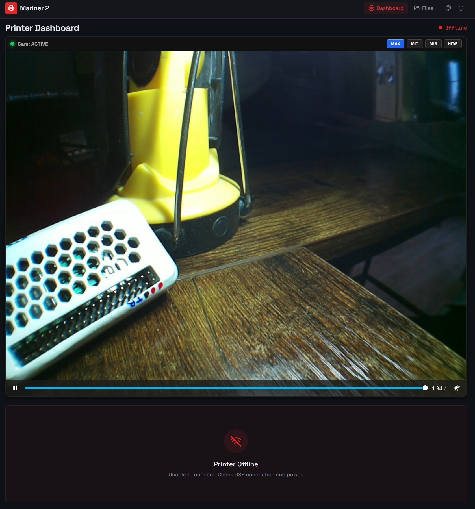

🔴 # Mariner 2 Cam for Pi Zero 2

### 3D-Printer Monitoring Tool with Camera Support + OTG-USB-Gadget, Firewall, VPN, Fail2ban, Webmin and a shutdown button
**Status:** Work-in-progress, but working stable and fine now. I went through all the steps in my guide again from a fresh install to test it.

>**Chitobox-Note:** The ctb decryption from amd989 had to be modified a bit to work on new `.ctb` files (is it a bug or caused by a Chitobox update?).

---

 **GitHub-Project:**
 
  🔴 [https://github.com/frittna/mariner2cam]  * **Last Changes:** 17:53 - 03.June.2026
  
  Is a fork from the great Mariner 2 (amd989)    - [https://github.com/amd989/mariner]
  
  Which was a fork from Mariner (luizribeiro)    - [https://github.com/luizribeiro/mariner]

---

### 📖 Complete Installation Guide & Code

A tested full step-by-step guide to make a fresh Zero 2 W installation can be found here.
You can run it yourself by following this tutorial in 1-2 hours (in German at the moment).

➡️ **[Click here to view: CompleteInstructionZero2.txt](CompleteInstructionZero2.txt)**

---

* **Note for Pi Zero 1.1:** There is a separate instruction for the Zero 1.1 which was *NOT COMPATIBLE* at the beginning with today's automatic scripts. But the Zero 1 is weak and I sold it, so it will not have the same state of progress. If you want to run it on the Zero 1, see the file: `"Anleitung - Mariner2 - PI Zero W 1.1+2 outdated (ARM6).txt"`.

---

### Screenshots

---
