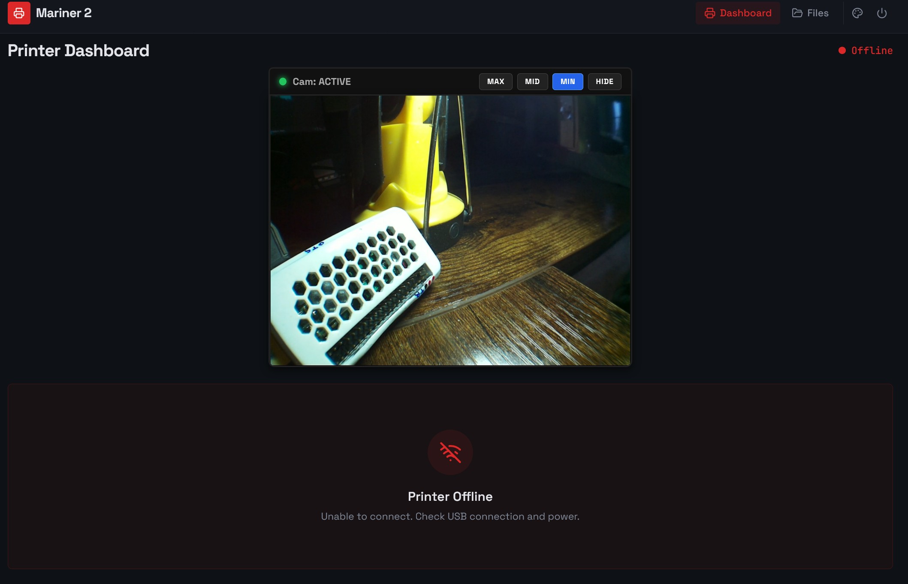

Mariner 2 Cam - 3D-Printer Monitoring Tool with Camera Support + OTG-USB-Gadget, Firewall, VPN, Fail2ban and Webmin installation
This is work-in-progress but's working stable for me! -> The mariner2 code from amd989's had to be modified slightly to accept my .ctb files at all.

Github-Project: https://github.com/frittna/mariner2cam
this is a fork from Mariner 2 - https://github.com/amd989/mariner 
what is a fork from Mariner   - https://github.com/luizribeiro/mariner

You can run it yourself by following this tutorial (in german at the moment)
--> There is seperate instruction for the Zero 1.1 wich was NOT COMPATIBLE at the beginning with todays automatic scripts. But the Zero 1 weak and i 
sold it so it will not the same state of progress. If you want to run it on the Zero 1 see "Anleitung - Mariner2 - PI Zero W 1.1+2 outdated (ARM6).txt"

Screenshots:
.. image:: Screenshot1maxDB.jpg
   :alt: Grafik1

.. image:: Screenshot3min_FM.jpg
   :alt: Grafik1
.. image:: Screenshot4print_preview.jpg
   :alt: Grafik1

  ==========   ============   ============   ============   ============   ============   ============   ============   

Mariner2Cam 3D-Drucker Monitoring Tool - mit Pi Zero W 2 - Trixie 64-bit-lite OS                     Stand: 02.Juni 2026 @frittn
mit Pi-CSI-Kamera-Support 1296x960 30fps + weitere Maßnahmen für sicheren Betrieb auch online

Github-Code  : Github-Code: https://github.com/frittna/mariner2cam
Baut auf Code: Github-Code: https://github.com/amd989/mariner
Änderungen gibt es hauptsächlich im Mariner Frontend füpr die Webseite, und der Datei ctb_encrypted.py.

Mein Drucker: Elegoo Mars 3
HINWEIS: Neue Chitubox .ctb Datein sind so verschlüsselt, dass Mariner recht langsam auf nur einem Core braucht das Vorschaubild lädt. Workaround: mit UVtools die .ctb sclice Datei neu abspeichern

###### VORBEREITUNG: (Raspberry Pi Imager Tool für Windows)
Auf dem Zero 2 W geht Trixie 64-bit OS-Lite.

##START##
Bei der Erstellung der SD-Karte (8GB oder mehr) mit Pi Imager und Windows schon SSH-Zugriff einstellen und Wlan-Settings setzen.
Image erstellen -> SD-Karte einlegen -> OTG-USB Port verwenden (der innere USB-Port von den 2 Ports) und Power-on..warten..~4min
Währenddessen die IP des Pi's ermitteln und am bestn fix vergeben (statische IP Reservierung am Internetrouter-Router)
Dann mit PUTTY oder anderem Tools über die Konsole und SSH verbinden.
Jetzt noch mit IP und Port 22, später wenn die Sicherheit mit Firewall und VPN hochgeschraubt wird über Port 50222 !

###### BEGINN DER BEFEHLE:
#Es mussten bei mir mindestens 4GB Platz vorhanden sein, teste mit dem Befehl: df -h

##Los gehts, System updaten:
sudo systemctl restart systemd-timesyncd
sudo apt update && sudo apt upgrade -y

sudo curl -fsSL https://amd989.github.io/mariner/setup.sh | sudo bash
sudo apt install mariner3d
sudo mariner3d-setup-pi --size 1280  #(ohne Argument sind es 2GB, bei 8GB SD-Karte 1280 GB nehmen)

#Da der USB-Gadget also das USB-Laufwerk in Windows nicht gleich angezeigt wird, muss man folgendes in die cmdline.txt hinzufügen:
sudo nano /boot/firmware/cmdline.txt     #Mit CTRL-O, Enter, CTRL-X speichern:
#in diese Datei nach rootwait hinzufügen (alles muss weiterhin in einer einzigen Zeile bleiben!):
modules-load=dwc2,g_mass_storage 
#Weil Windows 11 keine no-name ID's ohne SN# mehr akzeptiert:
sudo nano /etc/modprobe.d/usb_gadget.conf
#In diese Datei folgendes einfügen:
options g_mass_storage file=/piusb.bin stall=0 removable=1 idVendor=0x0525 idProduct=0xa4a5 iSerialNumber=123456
sudo nano /boot/firmware/config.txt
#in diese Datei folgendes kontrollieren oder unter [all] hinzufügen. 
dtoverlay=dwc2
enable_uart=1
dtoverlay=gpio-shutdown,gpio_pin=21,active_low=1,gpio_pull=up,debounce_ms=1000
#Die letzte Zeile ist nur für einen optionalen Shutdown-Button zwischen PIN40 (GPIO21) & PIN39 (GND) - wer das will

# JETZT DIE WICHTIGEN KORREKTUREN:
#Damit mariner mit ganz aktuellen Chitubox .ctb Dateien keine Probleme hat und stecken bleibt MUSS man 
#folgende Änderungen in der Datei ctb_encrypted.py vornehmen um einen Fehler einfach zu überspringen.
#Wenn die auto-skripts von oben gelaufen sind, ist der Pfad im folgenden sudo Befehl richtig
#Wenn nicht dann suche den richtigen Pfad der Datei mit dem Befehl: sudo find / -name "ctb_encrypted.py" 2>/dev/null
sudo nano /opt/venvs/mariner3d/lib/python3.13/site-packages/mariner/file_formats/ctb_encrypted.py

#in diese ctb_encrypted.py das genau so einfügen die 12 Leerzeichen beachten!
ab Zeile 256:  (springen in Zeile mit Strg + Shift + minus)
 
            # Validate hash
            checksum_bytes = ctb_slicer.checksum_value.to_bytes(8, "little")
            checksum_hash = computeSHA256Hash(checksum_bytes)
            encrypted_hash = _aes_crypt(checksum_hash, True)
#            file.seek(-HASH_LENGTH, 2)
#            hash = file.read(HASH_LENGTH)
             # CPU-TURBO-FIX:
            hash = b"00000000000000000000000000000000"  # 32 Dummy-Bytes
            encrypted_hash = b"00000000000000000000000000000000"

            if not (set(hash) == set(encrypted_hash)):
                print("WARNING: ChiTuBox-checksum differs, modded to just ignore this error..", flush=True)
#                raise TypeError(
#                    "The file checksum does not match, modded to ignore problem.\n"
#                    + str(hash)
#                    + "\n"
#                    + str(encrypted_hash)
#                    + "\n"
#                    + str(int.from_bytes(hash, "little"))
#                    + "\n"
#                    + str(int.from_bytes(encrypted_hash, "little"))
#                    + "\n"
#                    + str(int.from_bytes(checksum_hash, "little"))
#                )

            file.seek(ctb_slicer.layer_table_offset)

##(FALLS ein fertig modifiziertes ctb_encrypted.py vom PC auf den Pi kopiert wurde, die Dateirechte anpassen:
sudo chown pi:pi /opt/venvs/mariner3d/lib/python3.13/site-packages/mariner/file_formats/ctb_encrypted.py
sudo chmod 644 /opt/venvs/mariner3d/lib/python3.13/site-packages/mariner/file_formats/ctb_encrypted.py
#)

#wir müssen das Arbeitsverzeichnis wegen RAM-Platzmangel wo anders setzen
#oberhalb der Zeile "### Edits below this comment will be discarded" eintragen:
sudo systemctl edit mariner3d.service       
[Service]
Environment="TMPDIR=/var/tmp"

#In der Datei __init__.py folgenden Block fast ganz unten, so abändern (Abstände seitlich wieder genau beachten):
sudo nano /opt/venvs/mariner3d/lib/python3.13/site-packages/mariner/server/__init__.py

    else:
        logging.getLogger().setLevel(log_level)
    logging.getLogger("mariner").setLevel(log_level)
    logging.getLogger("waitress").setLevel(log_level)

    # --- HIER DIE ZWEI FIXES EINFÜGEN ---
    flask_app.config['WTF_CSRF_ENABLED'] = False
    flask_app.config['MAX_CONTENT_LENGTH'] = 1342177280
    import os
    os.environ['TMPDIR'] = '/var/tmp'
    # -----------------------------------

    serve(flask_app, host=config.get_http_host(), port=config.get_http_port()), max_request_body_size=1342177280)

#dann:
sudo systemctl daemon-reload
sudo systemctl restart mariner3d.service

#Damit mariner auch die Rechte für Dateien bearbeiten/Herunterfahren/Ausschalten hat:
sudo systemctl edit --full mariner3d.service
#im Abschnitt [Service] den User root ändern und die Group=root hinzufügen:
User=root
Group=root

sudo nano /etc/fstab
#in die letzte Zeile folgende Zeile einfügen:
/piusb.bin /mnt/usb_share vfat loop,rw,uid=1000,gid=33,dmask=000,fmask=000 0 0

#neu starten:
sudo reboot

sudo chown -R pi:www-data /mnt/usb_share
sudo chmod -R 775 /mnt/usb_share

#Jetzt noch WLAN Standby und serielle Konsolen (wegen Kamera) deaktivieren:
sudo iw wlan0 set power_save off     
sudo systemctl stop serial-getty@ttyS0
sudo systemctl mask serial-getty@ttyS0
sudo systemctl stop serial-getty@ttyAMA0
sudo systemctl mask serial-getty@ttyAMA0

##FERTIG## sudo reboot

Warten bis komplett neu gestartet hat - 2 Minuten+ mindestens.

#Den mariner Status prüfen? ->                   sudo systemctl status mariner3d.service

#Einsicht in die mariner-Logs hat man unter ->   sudo journalctl -u mariner3d.service -n 40 --no-pager

Mariner2 Webseiten im Browser laden:             http://192.168.0.XXX:5000/ 

#    Glückwunsch! - Nun fehlt noch die Implementierung der Pi Kamera falls man eine hat. Zusätzlich werden jetzt
#    wichtige Sicherheits-Maßnahmen gemacht, Samba-Share (lieber dann nur auf Bedarf aktiv lassen), 
#    Webmin als grafisches Admin-Tool für den Webbrowser am PC + Fail2Ban (brute force Attacken Abwehr)
#    und Tailscape als VPN-Dienst installiert, um Mariner2 auch von außen sicher zu erreichen.
#    ----------------------------------------------------------------------------

##Bei unbekannten Fehlern oder Problemen kann helfen:
#Cache löschen:
sudo sync && sudo sysctl -w vm.drop_caches=3
#Oder den USB-Container komplett zurücksetzen & neu erstellen
sudo umount -fl /mnt/usb_share
sudo modprobe -r g_mass_storage
sudo systemctl stop smbd nmbd
sudo rm -f /piusb.bin
sudo dd if=/dev/zero of=/piusb.bin bs=1M count=1024
sudo mkfs.vfat -F 32 -n "MARINER" /piusb.bin
sudo mkdir -p /mnt/usb_share
sudo mount -o loop,rw,uid=1000,gid=1000,dmask=000,fmask=000 /piusb.bin /mnt/usb_share
#Danach das USB-Gadget für den Drucker/PC wieder aktivieren:
sudo modprobe g_mass_storage file=/piusb.bin stall=0 removable=1 idVendor=0x0525 idProduct=0xa4a5 iSerialNumber=123456
rm /mnt/usb_share/* -rd    ##müll Ordner löschen
für eine Art Taskmanager in der Konsole gibt es den Befehl:  htop
#CPU Temperatur anzeigen, < 60°C wäre perfekt:           rpicam-still --version >/dev/null 2>&1; vcgencmd measure_temp
#laufende CPU-Temp-Überwachung in der Kommandozeie mit:  watch -n 2 vcgencmd measure_temp
#Wlan Stärke überprüfen:                                 sudo iwlist wlan0 scan | egrep "ESSID|Signal"

------------------------------------

#############################################################################
#############################################################################

### OPTIONAL: Samba-Netzwerklaufwerk einrichten (für Windows Netzwerke etc.)
## später im Betrieb Vorsicht wegen exklusiven Zugriff, ist eher ein nice to have feature
# 1.Samba installieren:
sudo apt install -y samba
# 2.Die Konfiguration bearbeiten:
sudo nano /etc/samba/smb.conf
#ganz am Ende der Datei folgenden Block einfügen speichern, (Strg-O, Enter, Strg-X)
[3D-Printer_USB]
   comment = Mariner2 3D-Print USB Share
   path = /mnt/usb_share
   browseable = yes
   read only = no
   guest ok = yes
   create mask = 0777
   directory mask = 0777
   force user = pi

# 3.Samba-Dienst neu starten, um Freigabe zu aktivieren:
sudo systemctl restart smbd

#Zugriff über Netzwerkadresse zb. \\192.168.X.XXX\3D-Printer_USB

## SAMBA Deaktivieren ?: 
sudo systemctl stop smbd nmbd
sudo systemctl disable smbd nmbd
-----------------------------------

#############################################################################

### OPTIONAL -  WEBMIN Installieren, Zeilen einzeln eingeben:
surl curl -o webmin-setup-repo.sh https://raw.githubusercontent.com/webmin/webmin/master/webmin-setup-repo.sh
sudo sh webmin-setup-repo.sh -f
sudo apt-get install webmin --install-recommends
#Zugriff dann möglich über: https://<192.168.X.XXX>:10000

########## Pi-CAMERA SUPPORT Zero 2
sudo nano /boot/firmware/config.txt
#suchen und aktivieren oder ganz unten eintragen:
camera_auto_detect=1
dtoverlay=vc4-kms-v3d

# Wichtig ->Kamera-Blockade durch systemd/Pipewire lösen: (Fehlermeldungen falls nicht vohanden ignorieren)
systemctl --user stop pipewire wireplumber pipewire.socket 2>/dev/null
systemctl --user disable pipewire wireplumber pipewire.socket 2>/dev/null
systemctl --user mask pipewire wireplumber pipewire.socket
sudo killall -9 pipewire wireplumber 2>/dev/null
#libcamera installieren, werden von mediamtx verwendet:
sudo apt update && sudo apt install -y rpicam-apps libcamera-apps

#ganzen Block einfügen und ausführen:
sudo mkdir -p /etc/mediamtx
cd /tmp
URL_HOST="github.com"
URL_PATH="bluenviron/mediamtx/releases/download/v1.9.3/mediamtx_v1.9.3_linux_arm64v8.tar.gz"
curl -L "https://${URL_HOST}/${URL_PATH}" -o mediamtx.tar.gz
tar -xzf mediamtx.tar.gz
sudo mv mediamtx /usr/bin/
sudo mv mediamtx.yml /etc/mediamtx/
sudo chmod +x /usr/bin/mediamtx

#ganzen Block einfügen und ausführen:
sudo tee /etc/systemd/system/mediamtx.service << 'EOF'
[Unit]
Description=MediaMTX RTSP / WebRTC Server
After=network.target

[Service]
Type=simple
User=root
ExecStart=/usr/bin/mediamtx /etc/mediamtx/mediamtx.yml
Restart=always
RestartSec=5

[Install]
WantedBy=multi-user.target
EOF

sudo nano /etc/mediamtx/mediamtx.yml
#folgendes suchen und kontrollieren dass kein # davor seht:
webrtc: yes
webrtcAddress: :8889
webrtcLocalUDPAddress: :8189
webrtcIPsFromInterfaces: yes
webrtcAdditionalHosts: [100.X.X.X]
#da du diese IP im Moment nicht wissen kannst muss du sie später nochmal eintragen, oder wenn das VPN-Zertifikat abläuft

#folgenden Block genau so abändern, beachte die gelöschten [] nach webrtcICEServers2:

webrtcICEServers2:
  - url: stun:stun.l.google.com:19302
  # if user is "AUTH_SECRET", then authentication is secret based.
  # the secret must be inserted into the password field.
  # username: ''
  # password: ''
  # clientOnly: false

#und ganz am Ende der selben Datei nach all_others: das so einfügen (seitliche Abstände beachten!):
  all_others:
  cam:
    source: rpiCamera
    rpiCameraWidth: 1296
    rpiCameraHeight: 972
    rpiCameraFps: 30              # 15 falls schonender sein soll
    rpiCameraBitRate: 4000000     # erhöht auf 4 Mbps
    rpiCameraProfile: main

### MediaMTX als Systemdienst aktivieren und starten
sudo systemctl daemon-reload
sudo systemctl enable mediamtx.service
sudo systemctl restart mediamtx.service

### Frontend-Fixes:
#den folgenden block ausführen:
sudo tee -a /opt/venvs/mariner3d/lib/python3.13/site-packages/mariner/server/app.py << 'EOF'

# Erlaubt dem Frontend, die Kamera-Last auf dem Pi komplett abzuschalten
@app.route('/api/camera/<action>', methods=['POST'])
@csrf.exempt
def control_camera(action: str):
    if action == 'stop':
        import subprocess
        subprocess.run(["sudo", "systemctl", "stop", "mediamtx"])
        return {"status": "Kamera gestoppt, CPU entlastet"}, 200
    elif action == 'start':
        import subprocess
        subprocess.run(["sudo", "systemctl", "start", "mediamtx"])
        return {"status": "Kamera gestartet"}, 200
    return {"error": "Ungueltige Aktion"}, 400
EOF

#NUN AM PC DIE DATEI ÖFFNEN: C:\mariner\frontend\src\pages\Index.tsx und den gesamten Inhalt ersetzen:

######
import { useQuery, useQueryClient } from "@tanstack/react-query";
import { PrintProgress } from "@/components/PrintProgress";
import { PrintControls } from "@/components/PrintControls";
import { StatusIndicator } from "@/components/StatusIndicator";
import { api, mapPrinterState, type PrinterStatus } from "@/lib/api";
import { WifiOff, CheckCircle2, Loader2 } from "lucide-react";
import { Link } from "react-router-dom";
import { Button } from "@/components/ui/button";
import { useState } from "react";

export default function Index() {
  const queryClient = useQueryClient();
type CamSize = 'MAX' | 'MID' | 'MIN' | 'HIDE';
const [camSize, setCamSize] = useState<CamSize>('MAX');

  const handleSizeChange = async (size: CamSize) => {
    // 1. Visuell im Browser umschalten (Größe anpassen / Iframe unmounten)
    setCamSize(size);

    // 2. Befehl an das Python-Backend senden, um MediaMTX zu stoppen/starten
    try {
      const action = size === 'HIDE' ? 'stop' : 'start';
      await fetch(`/api/camera/${action}`, { 
        method: 'POST' 
      });
    } catch (error) {
      console.error("Fehler beim Umschalten des Kamera-Dienstes im Backend:", error);
    }
  };

  const { data, isLoading, error } = useQuery({
    queryKey: ["printStatus"],
    queryFn: () => api.printStatus(),
    refetchInterval: 5000,
  });

  const status: PrinterStatus = data ? mapPrinterState(data.state) : "offline";

  const refresh = () =>
    queryClient.invalidateQueries({ queryKey: ["printStatus"] });

  const handlePause = async () => {
    await api.printerCommand("pause_print");
    refresh();
  };

  const handleResume = async () => {
    await api.printerCommand("resume_print");
    refresh();
  };

  const handleCancel = async () => {
    await api.printerCommand("cancel_print");
    refresh();
  };

  const printerName =
    document
      .querySelector('meta[name="printer-display-name"]')
      ?.getAttribute("content") || undefined;

  const job = data
    ? {
        fileName: data.selected_file || "",
        currentLayer: data.current_layer ?? 0,
        totalLayers: data.layer_count ?? 0,
        progress: data.progress,
        elapsedTime: data.print_time_secs
          ? data.print_time_secs - (data.time_left_secs ?? 0)
          : 0,
        remainingTime: data.time_left_secs ?? 0,
        status,
      }
    : null;

  return (
    

      

        

          <h1 className="text-2xl font-bold tracking-tight">
            Printer Dashboard
          </h1>
          {printerName && (
            
{printerName}

          )}
        

        <StatusIndicator status={status} />
      

      {/* Mariner2 HD Live Video Stream mit 4-Stage Toggle Control (MediaMTX) */}
      

  
  

    

      
      {camSize === 'HIDE' ? 'Cam: DEACTIVATED' : 'Cam: ACTIVE'}
    

    

      {(['MAX', 'MID', 'MIN', 'HIDE'] as CamSize[]).map((size) => (
        <button
          key={size}
          onClick={() => handleSizeChange(size)}
          style={{
            padding: '3px 10px',
            fontSize: '10px',
            backgroundColor: camSize === size ? '#2563eb' : '#222',
            color: '#fff',
            border: camSize === size ? '1px solid #60a5fa' : '1px solid #444',
            borderRadius: '4px',
            cursor: 'pointer',
            fontWeight: 'bold',
            letterSpacing: '0.5px',
            transition: 'all 0.2s'
          }}
        >
          {size}
        </button>
      ))}
    

  

  {/* Last-Stopp Logik: Wenn camSize 'HIDE' ist, wird das iframe komplett gelöscht */}
  {camSize !== 'HIDE' && (
    

      <iframe 
        src={typeof window !== 'undefined' ? `http://${window.location.hostname}:8889/cam` : ''}
        title="Printer Live View"
        scrolling="no"
        style={{ width: '100%', height: '100%', border: 'none', display: 'block', overflow: 'hidden' }}
      />
    

  )}

      {/* Mariner2: Dynamische Modell-Vorschau oberhalb des Druckerstatus (Nur wenn gedruckt/pausiert wird) */}
      {!isLoading && !error && (status === "printing" || status === "paused") && job?.fileName && (
        

          

            

              Modell-Vorschau: {job.fileName}
            

          

          

             {
                e.currentTarget.style.display = 'none';
                const parent = e.currentTarget.parentElement;
                if (parent) { parent.innerHTML = '
Keine Vorschau im Cache verfügbar
'; }
              }}
            />
          

        

      )}

      {/* Reguläre Drucker-Steuerungskarten werden nur gerendert, wenn kein Verbindungs- oder Ladefehler vorliegt */}
      {isLoading && (
        

          <Loader2 className="h-8 w-8 animate-spin text-primary" />
          
Connecting to printer...

        

      )}

      {error && (
        

          <WifiOff className="h-8 w-8 text-destructive" />
          <h2 className="mt-4 text-lg font-semibold">Connection Error</h2>
          
Could not reach the printer. Check that the backend is running.

        

      )}

      {!isLoading && !error && (
        

          {(status === "printing" || status === "paused") && job && (
            

              

                <PrintProgress job={job} />
              

              <PrintControls
                status={status}
                onPause={handlePause}
                onResume={handleResume}
                onCancel={handleCancel}
              />
            

          )}

          {status === "idle" && (
            

              

                <CheckCircle2 className="h-8 w-8 text-success" />
              

              <h2 className="mt-4 text-lg font-semibold">Ready to Print</h2>
              
Select a file from the File Manager to start printing.

              <Button asChild className="mt-4">
                <Link to="/files">Open File Manager</Link>
              </Button>
            

          )}

          {status === "offline" && (
            

              

                <WifiOff className="h-8 w-8 text-destructive" />
              

              <h2 className="mt-4 text-lg font-semibold">Printer Offline</h2>
              
Unable to connect. Check USB connection and power.

            

          )}
        

      )}
    

  );
}
#####
#####
#####
#####

DAS SELBE AM PC MIT DER DATEI : C:\mariner\frontend\src\pages\Files.tsx machen und alles ersetzten.

#####
#####
#####
#####
#####

import { useState, useRef, useEffect } from "react";
import { useMutation, useQuery, useQueryClient } from "@tanstack/react-query";
import {
  api,
  formatTime,
  type FileEntry,
  type DirectoryEntry,
} from "@/lib/api";
import { FileDetailDialog } from "@/components/FileDetailDialog";
import { Button } from "@/components/ui/button";
import {
  Dialog,
  DialogContent,
  DialogDescription,
  DialogFooter,
  DialogHeader,
  DialogTitle,
} from "@/components/ui/dialog";
import { toast } from "@/components/ui/sonner";
import {
  Folder,
  FileText,
  Layers,
  Clock,
  Upload,
  Loader2,
  ArrowLeft,
  FolderPlus,
} from "lucide-react";

function FileIcon({ canBePrinted }: { canBePrinted: boolean }) {
  if (canBePrinted) return <Layers className="h-4 w-4 text-primary" />;
  return <FileText className="h-4 w-4 text-muted-foreground" />;
}

export default function Files() {
  const [currentPath, setCurrentPath] = useState(".");
  const [selectedFile, setSelectedFile] = useState<FileEntry | null>(null);
  const [dialogOpen, setDialogOpen] = useState(false);
  const [newFolderOpen, setNewFolderOpen] = useState(false);
  const [newFolderName, setNewFolderName] = useState("");
  const fileInputRef = useRef<HTMLInputElement>(null);
  const queryClient = useQueryClient();
  type CamSize = 'MAX' | 'MID' | 'MIN' | 'HIDE';
  const [camSize, setCamSize] = useState<CamSize>('MAX');

  const handleSizeChange = async (size: CamSize) => {
    // 1. Visuell im Browser umschalten (Größe anpassen / Iframe unmounten)
    setCamSize(size);

    // 2. Befehl an das Python-Backend senden, um MediaMTX zu stoppen/starten
    try {
      const action = size === 'HIDE' ? 'stop' : 'start';
      await fetch(`/api/camera/${action}`, { 
        method: 'POST' 
      });
    } catch (error) {
      console.error("Fehler beim Umschalten des Kamera-Dienstes im Backend:", error);
    }
  };

  const { data, isLoading } = useQuery({
    queryKey: ["files", currentPath],
    queryFn: () => api.listFiles(currentPath),
  });

  const createFolderMutation = useMutation({
    mutationFn: (name: string) => api.createDirectory(currentPath, name),
    onSuccess: () => {
      queryClient.invalidateQueries({ queryKey: ["files", currentPath] });
      toast.success("Folder created");
      setNewFolderOpen(false);
      setNewFolderName("");
    },
    onError: (err: Error) => {
      toast.error(err.message || "Could not create folder");
    },
  });

  useEffect(() => {
    if (!newFolderOpen) setNewFolderName("");
  }, [newFolderOpen]);

  const handleDirectoryClick = (dirname: string) => {
    if (dirname === "..") {
      setCurrentPath((prev) => {
        const parts = prev.split("/").filter(Boolean);
        parts.pop();
        return parts.length === 0 ? "." : parts.join("/");
      });
    } else {
      setCurrentPath((prev) => (prev === "." ? dirname : `${prev}/${dirname}`));
    }
  };

  const handleFileClick = (file: FileEntry) => {
    setSelectedFile(file);
    setDialogOpen(true);
  };

  const handleUpload = async (e: React.ChangeEvent<HTMLInputElement>) => {
    const file = e.target.files?.[0];
    if (!file) return;
    await api.uploadFile(file, currentPath);
    queryClient.invalidateQueries({ queryKey: ["files", currentPath] });
    e.target.value = "";
  };

  const handleCreateFolder = () => {
    const name = newFolderName.trim();
    if (!name) return;
    createFolderMutation.mutate(name);
  };

  return (
    

      

        

          <h1 className="text-2xl font-bold tracking-tight">File Manager</h1>
          

            {currentPath === "." ? "/" : `/${currentPath}`}
          

        

        

          <input
            ref={fileInputRef}
            type="file"
            className="hidden"
            onChange={handleUpload}
          />
          <Button
            variant="outline"
            size="sm"
            className="gap-1.5"
            onClick={() => setNewFolderOpen(true)}
          >
            <FolderPlus className="h-3.5 w-3.5" />
            New folder
          </Button>
          <Button
            variant="outline"
            size="sm"
            className="gap-1.5"
            onClick={() => fileInputRef.current?.click()}
          >
            <Upload className="h-3.5 w-3.5" />
            Upload
          </Button>
        

      

      {/* Mariner2 HD Live Video Stream mit 4-Stage Toggle Control im File Manager */}
      

  
  

    

      
      {camSize === 'HIDE' ? 'Cam: DEACTIVATED' : 'Cam: ACTIVE'}
    

    

      {([ 'MAX', 'MID', 'MIN', 'HIDE' ] as CamSize[]).map((size) => (
        <button
          key={size}
          onClick={() => handleSizeChange(size)}
          style={{
            padding: '3px 10px',
            fontSize: '10px',
            backgroundColor: camSize === size ? '#2563eb' : '#222',
            color: '#fff',
            border: camSize === size ? '1px solid #60a5fa' : '1px solid #444',
            borderRadius: '4px',
            cursor: 'pointer',
            fontWeight: 'bold',
            letterSpacing: '0.5px',
            transition: 'all 0.2s'
          }}
        >
          {size}
        </button>
      ))}
    

  

  {/* Physischer Last-Stopp für die Dateiseite */}
  {camSize !== 'HIDE' && (
    

      <iframe 
        src={typeof window !== 'undefined' ? `http://${window.location.hostname}:8889/cam` : ''}
        title="Printer Files View"
        scrolling="no"
        style={{ width: '100%', height: '100%', border: 'none', display: 'block', overflow: 'hidden' }}
      />
    

  )}

      

        {isLoading ? (
          

            <Loader2 className="h-6 w-6 animate-spin text-primary" />
            
              Loading files...
            
          

        ) : (
          

            {currentPath !== "." && (
              <button
                onClick={() => handleDirectoryClick("..")}
                className="flex w-full items-center gap-2 rounded-md px-3 py-2.5 text-left text-sm transition-colors hover:bg-muted"
              >
                <ArrowLeft className="h-3.5 w-3.5 text-muted-foreground" />
                <Folder className="h-4 w-4 text-primary" />
                ..
              </button>
            )}
            {data?.directories.map((dir: DirectoryEntry) => (
              <button
                key={dir.dirname}
                onClick={() => handleDirectoryClick(dir.dirname)}
                className="flex w-full items-center gap-2 rounded-md px-3 py-2.5 text-left text-sm transition-colors hover:bg-muted"
              >
                <Folder className="h-4 w-4 text-primary" />
                {dir.dirname}
              </button>
            ))}
            {data?.files.map((file: FileEntry) => (
              <button
                key={file.filename}
                onClick={() => handleFileClick(file)}
                className="flex w-full items-center gap-2 rounded-md px-3 py-2.5 text-left text-sm transition-colors hover:bg-muted"
              >
                <FileIcon canBePrinted={file.can_be_printed} />
                
                  {file.filename}
                
                

                  {file.print_time_secs && (
                    
                      <Clock className="h-3 w-3" />
                      {formatTime(file.print_time_secs)}
                    
                  )}
                  {file.can_be_printed && (
                    
                      print
                    
                  )}
                

              </button>
            ))}
            {data && data.directories.length === 0 && data.files.length === 0 && (
              

                No files found in this directory.
              

            )}
          

        )}
      

      <FileDetailDialog
        file={selectedFile}
        open={dialogOpen}
        onOpenChange={setDialogOpen}
      />

      <Dialog open={newFolderOpen} onOpenChange={setNewFolderOpen}>
        <DialogContent className="sm:max-w-md">
          <DialogHeader>
            <DialogTitle>New folder</DialogTitle>
            <DialogDescription>
              Create a folder in{" "}
              
                {currentPath === "." ? "/" : `/${currentPath}`}
              
              .
            </DialogDescription>
          </DialogHeader>
          <input
            autoFocus
            value={newFolderName}
            onChange={(e) => setNewFolderName(e.target.value)}
            onKeyDown={(e) => {
              if (e.key === "Enter") handleCreateFolder();
            }}
            placeholder="Folder name"
            className="flex h-9 w-full rounded-md border border-input bg-background px-3 py-1 text-sm shadow-sm ring-offset-background file:border-0 file:bg-transparent file:text-sm file:font-medium placeholder:text-muted-foreground focus-visible:outline-none focus-visible:ring-2 focus-visible:ring-ring"
          />
          <DialogFooter>
            <Button
              type="button"
              variant="ghost"
              onClick={() => setNewFolderOpen(false)}
            >
              Cancel
            </Button>
            <Button
              type="button"
              disabled={!newFolderName.trim() || createFolderMutation.isPending}
              onClick={handleCreateFolder}
            >
              {createFolderMutation.isPending ? (
                <>
                  <Loader2 className="mr-1.5 h-3.5 w-3.5 animate-spin" />
                  Creating…
                </>
              ) : (
                "Create"
              )}
            </Button>
          </DialogFooter>
        </DialogContent>
      </Dialog>
    

  );
}

#####

### das gerade verändertes Frontend jetzt am PC kompilieren und auf den Pi übertragen:
Dazu jetzt in Windows das Softwarepaket zum Kompilieren installieren: Installer: node-v24.16.0-x64.msi (Node.js install googlen)
Öffne die Windows-Eingabeaufforderung (cmd) auf deinem PC und gehe in den Ordner Frontend:
cd C:\mariner\frontend
npm run build -- --base=./
# Den erzeugten Ordner "dist" aus mariner/frontend mit der Samba-Freigabe auf den Pi kopieren. Windows-Netzlaufwerk lieber wieder trennen
# Danach im Putty-Terminal des Pi den Ordner an die richtige Stelle kopieren:

#Am Zero 2 W - Frontend-Refresh:
sudo rm -rf /opt/venvs/mariner3d/dist
sudo mkdir -p /opt/venvs/mariner3d/dist
sudo cp -r /mnt/usb_share/dist/* /opt/venvs/mariner3d/dist/
sudo chown -R root:root /opt/venvs/mariner3d/dist
sudo chmod -R 755 /opt/venvs/mariner3d/dist
rm -rf /mnt/usb_share/dist/
sudo systemctl restart mariner3d.service

# Noch kein Kamerabild und Fehler im Kamerafenster..? ist evtl. noch wegen den noch folgenden Sicherheitseinstellungen:
# Den Video-Stream findet man SPÄTER auch extra unter den Link:    http://192.168.0.XXX:8889/cam/
# Im Browser für das Dashboard einmal hard refreh (STRG+F5) drücken sollte bis auf Kamera gehen.
#
# ==============================================================================
# NOCH EIN PAAR SICHERHEITS TIPS MIT 4 MASSNAHMEN
# ==============================================================================
# 1. Firewall installieren und absichern:
sudo apt install ufw

sudo ufw default deny incoming
sudo ufw default allow outgoing
# Ports für MediaMTX (Stream & Steuerung):
sudo ufw allow 8889/tcp                             # MediaMTX WebRTC/HLS
sudo ufw allow 8554/tcp                             # MediaMTX RTSP
sudo ufw allow 8189/udp				    # WebRTC MediaMTX 
sudo ufw allow 8189/tcp				    # WebUTC MediaMTX
sudo ufw allow in on tailscale0			    # VPN
sudo ufw allow 50222/tcp			    # SSH-Port
sudo ufw allow from 192.168.0.0/24 to any app Samba # samba-sharing
# System-Zugriffe NUR aus dem lokalen Netzwerk (192.168.0.X) erlauben:
sudo ufw allow from 192.168.0.0/24 to any port 50222 # Neuer SSH-Port
sudo ufw allow from 192.168.0.0/24 to any port 5000  #  Mariner WebBrowser
sudo ufw allow from 192.168.0.0/24 to any port 10000 # Webmin Browser
# Firewall scharf schalten und neu laden:
sudo ufw enable
sudo ufw reload

sudo nano /etc/ssh/sshd_config
#in dieser Datei bei #Port 22 das # entfernen und auf Port 50222 ändern, bei #PubkeyAuthentication yes auch das # entfernen
sudo systemctl restart ssh

#!! Ab nun ist SSH Login über Port 50222 und nur noch mir Auth Key erreichbar.

# 2. Fail2Ban installieren (loggt und sperrt brute force logins):
sudo apt install fail2ban

# 3. SSH auf Key statt Passwort umstellen (falls nicht von anfang an mit Pi Imager so eingestellt wurde):
# Am PC folgendes in der Eingabeaufforderung (cmd) ausführen und 3x Enter drücken:
# ssh-keygen -t ed25519 -b 4096
# Im Ordner C:/Users/Name/.ssh/ die erstellte "id_ed25519.pub" mit Texteditor öffnen,
# alles kopieren und auf dem PI in folgende Datei einfügen:
nano ~/.ssh/authorized_keys
chmod 600 ~/.ssh/authorized_keys
# SSH-Dienst konfigurieren:
sudo nano /etc/ssh/sshd_config
# -> Bei "Port" das # wegnehmen und 50222 eintragen.
# -> Bei "PasswordAuthentication" auf "no" setzen.
# GANZ UNTEN in der sshd_config anfügen (repariert den Webmin-Login auf dem Pi):
Match Address 127.0.0.1
    PasswordAuthentication yes
# SSH-Dienst neu starten:
sudo systemctl restart ssh
# WICHTIG: Mit Puttygen die zb:"id_ed25519" am PC in eine ".ppk" umwandeln! (hinweis, bei Pi Imager die den normalen Pub Key nehmen sonst geht es nicht)
# In Putty 0.83 unter SSH -> Auth -> Credentials die ".ppk" laden.
# Vor dem Trennen der aktuellen Verbindung IMMER im neuen Fenster prüfen,
# ob der Login passwortlos klappt – sonst droht Aussperrung!

# 4. VPN für Verbindungen von Außen (die ja sonst geblockt werden):
# Das Skript tailscale laden
curl -fsSL https://tailscale.com/install.sh | sh
sudo tailscale up
-

Was passiert nach sudo tailscale up? Der Pi generiert in der Konsole eine eindeutige Internetadresse (einen Login-Link).Kopieren Sie diesen Link und öffnen Sie ihn im Browser auf Ihrem PC.Melden Sie sich dort an oder einloggen. Der Pi wird sofort in Ihr privates Netzwerk aufgenommen und erhält eine eigene, dauerhafte IP-Adresse (beginnend mit 100.X.X.X).

Wenn das Verknpüfen am PI scheinbar nicht geht und ein Ping und die Zeile mit der Adresse im Pi-Command stecken bleibt folgende Maßnahme machen:
Schritt 1: Den richtigen Auth-Key am PC erstellen. Öffnen Sie an Ihrem PC oder Smartphone die Tailscale-Webseite und loggen Sie sich mit dem Konto ein, das auch auf Ihrem Handy aktiv ist. 

Navigieren Sie im Menü zu: Settings -> unten bei Personal Keys:
Generate auth key... (Authentifizierungs-Schlüssel erstellen).Lassen Sie die Einstellungen einfach auf Standard

Den Pi direkt per Schlüssel einbuchen, dazu mit Strg-C mal den stehenden Prozess abbrechen. Auf dem Pi und den tailscale Befehl nochmal zusammen mit Ihrem kopierten Schlüssel eingeben und Schlüssel nach dem authkey= im Befehl einbetten:

sudo tailscale up --authkey=tskey-auth-DEIN_KOPIERTER_SCHLÜSSEL_HIER

#Da wir jetzt unsere Teilscale Pi-IP kennen müssen wir sie statt "webrtcAdditionalHosts: [100.X.X.X]" noch eintragen:
sudo nano /etc/mediamtx/mediamtx.yml
#Stelle suchen mit STRG-F und die echte IP des Pi's über Tailscale eintragen. (

#Fertig, wirklich wahr! - nun hat man noch 1,5GB der insg. 8GB-SD frei, wobei 1.25 immer mind. frei bleiben müssen wegen Auslagerung einer eingelesenen max.1GB (einstellbar) Slice-Datei. Vielleicht nochmal mit df -h den freien Speicherplatz checken.
#Erinnerung: PUTTY ZUGRIFF AB JETZT NUR NOCH UNTER PORT:50222 und mit Auth-Key, oder Webmin

#Wer will kann noch Bluetooth und HDMI deaktivieren um Strom zu sparen:
sudo nano /boot/firmware/config.txt     #bei [all] unten dazuschreiben:
dtoverlay=disable-bt
sudo nano /boot/firmware/cmdline.txt    #folgendes hinten anhängen:
 video=HDMI-A-1:d
sudo systemctl disable bluetooth.service
sudo systemctl mask bluetooth.service
sudo reboot
*******************************************************************************************
#ENDE DER ANLEITUNG
*******************************************************************************************
Mariner 2 Cam - 3D-Printer Monitoring Tool with Camera Support + OTG-USB-Gadget, Firewall, VPN, Fail2ban and Webmin installation
This is work-in-progress but's working stable for me! -> The mariner2 code from amd989's had to be modified slightly to accept my .ctb files at all.

Github-Project: https://github.com/frittna/mariner2cam
this is a fork from Mariner 2 - https://github.com/amd989/mariner 
what is a fork from Mariner   - https://github.com/luizribeiro/mariner

You can run it yourself by following this tutorial (in german at the moment)
--> There is seperate instruction for the Zero 1.1 wich was NOT COMPATIBLE at the beginning with todays automatic scripts. But the Zero 1 weak and i 
sold it so it will not the same state of progress. If you want to run it on the Zero 1 see "Anleitung - Mariner2 - PI Zero W 1.1+2 outdated (ARM6).txt"

Screenshots:
.. image:: Screenshot1maxDB.jpg
   :alt: Grafik1

.. image:: Screenshot3min_FM.jpg
   :alt: Grafik1
.. image:: Screenshot4print_preview.jpg
   :alt: Grafik1

  ==========   ============   ============   ============   ============   ============   ============   ============   

Mariner2Cam 3D-Drucker Monitoring Tool - mit Pi Zero W 2 - Trixie 64-bit-lite OS                     Stand: 02.Juni 2026 @frittn
mit Pi-CSI-Kamera-Support 1296x960 30fps + weitere Maßnahmen für sicheren Betrieb auch online

Github-Code  : Github-Code: https://github.com/frittna/mariner2cam
Baut auf Code: Github-Code: https://github.com/amd989/mariner
Änderungen gibt es hauptsächlich im Mariner Frontend füpr die Webseite, und der Datei ctb_encrypted.py.

Mein Drucker: Elegoo Mars 3
HINWEIS: Neue Chitubox .ctb Datein sind so verschlüsselt, dass Mariner recht langsam auf nur einem Core braucht das Vorschaubild lädt. Workaround: mit UVtools die .ctb sclice Datei neu abspeichern

###### VORBEREITUNG: (Raspberry Pi Imager Tool für Windows)
Auf dem Zero 2 W geht Trixie 64-bit OS-Lite.

##START##
Bei der Erstellung der SD-Karte (8GB oder mehr) mit Pi Imager und Windows schon SSH-Zugriff einstellen und Wlan-Settings setzen.
Image erstellen -> SD-Karte einlegen -> OTG-USB Port verwenden (der innere USB-Port von den 2 Ports) und Power-on..warten..~4min
Währenddessen die IP des Pi's ermitteln und am bestn fix vergeben (statische IP Reservierung am Internetrouter-Router)
Dann mit PUTTY oder anderem Tools über die Konsole und SSH verbinden.
Jetzt noch mit IP und Port 22, später wenn die Sicherheit mit Firewall und VPN hochgeschraubt wird über Port 50222 !

###### BEGINN DER BEFEHLE:
#Es mussten bei mir mindestens 4GB Platz vorhanden sein, teste mit dem Befehl: df -h

##Los gehts, System updaten:
sudo systemctl restart systemd-timesyncd
sudo apt update && sudo apt upgrade -y

sudo curl -fsSL https://amd989.github.io/mariner/setup.sh | sudo bash
sudo apt install mariner3d
sudo mariner3d-setup-pi --size 1280  #(ohne Argument sind es 2GB, bei 8GB SD-Karte 1280 GB nehmen)

#Da der USB-Gadget also das USB-Laufwerk in Windows nicht gleich angezeigt wird, muss man folgendes in die cmdline.txt hinzufügen:
sudo nano /boot/firmware/cmdline.txt     #Mit CTRL-O, Enter, CTRL-X speichern:
#in diese Datei nach rootwait hinzufügen (alles muss weiterhin in einer einzigen Zeile bleiben!):
modules-load=dwc2,g_mass_storage 
#Weil Windows 11 keine no-name ID's ohne SN# mehr akzeptiert:
sudo nano /etc/modprobe.d/usb_gadget.conf
#In diese Datei folgendes einfügen:
options g_mass_storage file=/piusb.bin stall=0 removable=1 idVendor=0x0525 idProduct=0xa4a5 iSerialNumber=123456
sudo nano /boot/firmware/config.txt
#in diese Datei folgendes kontrollieren oder unter [all] hinzufügen. 
dtoverlay=dwc2
enable_uart=1
dtoverlay=gpio-shutdown,gpio_pin=21,active_low=1,gpio_pull=up,debounce_ms=1000
#Die letzte Zeile ist nur für einen optionalen Shutdown-Button zwischen PIN40 (GPIO21) & PIN39 (GND) - wer das will

# JETZT DIE WICHTIGEN KORREKTUREN:
#Damit mariner mit ganz aktuellen Chitubox .ctb Dateien keine Probleme hat und stecken bleibt MUSS man 
#folgende Änderungen in der Datei ctb_encrypted.py vornehmen um einen Fehler einfach zu überspringen.
#Wenn die auto-skripts von oben gelaufen sind, ist der Pfad im folgenden sudo Befehl richtig
#Wenn nicht dann suche den richtigen Pfad der Datei mit dem Befehl: sudo find / -name "ctb_encrypted.py" 2>/dev/null
sudo nano /opt/venvs/mariner3d/lib/python3.13/site-packages/mariner/file_formats/ctb_encrypted.py

#in diese ctb_encrypted.py das genau so einfügen die 12 Leerzeichen beachten!
ab Zeile 256:  (springen in Zeile mit Strg + Shift + minus)
 
            # Validate hash
            checksum_bytes = ctb_slicer.checksum_value.to_bytes(8, "little")
            checksum_hash = computeSHA256Hash(checksum_bytes)
            encrypted_hash = _aes_crypt(checksum_hash, True)
#            file.seek(-HASH_LENGTH, 2)
#            hash = file.read(HASH_LENGTH)
             # CPU-TURBO-FIX:
            hash = b"00000000000000000000000000000000"  # 32 Dummy-Bytes
            encrypted_hash = b"00000000000000000000000000000000"

            if not (set(hash) == set(encrypted_hash)):
                print("WARNING: ChiTuBox-checksum differs, modded to just ignore this error..", flush=True)
#                raise TypeError(
#                    "The file checksum does not match, modded to ignore problem.\n"
#                    + str(hash)
#                    + "\n"
#                    + str(encrypted_hash)
#                    + "\n"
#                    + str(int.from_bytes(hash, "little"))
#                    + "\n"
#                    + str(int.from_bytes(encrypted_hash, "little"))
#                    + "\n"
#                    + str(int.from_bytes(checksum_hash, "little"))
#                )

            file.seek(ctb_slicer.layer_table_offset)

##(FALLS ein fertig modifiziertes ctb_encrypted.py vom PC auf den Pi kopiert wurde, die Dateirechte anpassen:
sudo chown pi:pi /opt/venvs/mariner3d/lib/python3.13/site-packages/mariner/file_formats/ctb_encrypted.py
sudo chmod 644 /opt/venvs/mariner3d/lib/python3.13/site-packages/mariner/file_formats/ctb_encrypted.py
#)

#wir müssen das Arbeitsverzeichnis wegen RAM-Platzmangel wo anders setzen
#oberhalb der Zeile "### Edits below this comment will be discarded" eintragen:
sudo systemctl edit mariner3d.service       
[Service]
Environment="TMPDIR=/var/tmp"

#In der Datei __init__.py folgenden Block fast ganz unten, so abändern (Abstände seitlich wieder genau beachten):
sudo nano /opt/venvs/mariner3d/lib/python3.13/site-packages/mariner/server/__init__.py

    else:
        logging.getLogger().setLevel(log_level)
    logging.getLogger("mariner").setLevel(log_level)
    logging.getLogger("waitress").setLevel(log_level)

    # --- HIER DIE ZWEI FIXES EINFÜGEN ---
    flask_app.config['WTF_CSRF_ENABLED'] = False
    flask_app.config['MAX_CONTENT_LENGTH'] = 1342177280
    import os
    os.environ['TMPDIR'] = '/var/tmp'
    # -----------------------------------

    serve(flask_app, host=config.get_http_host(), port=config.get_http_port()), max_request_body_size=1342177280)

#dann:
sudo systemctl daemon-reload
sudo systemctl restart mariner3d.service

#Damit mariner auch die Rechte für Dateien bearbeiten/Herunterfahren/Ausschalten hat:
sudo systemctl edit --full mariner3d.service
#im Abschnitt [Service] den User root ändern und die Group=root hinzufügen:
User=root
Group=root

sudo nano /etc/fstab
#in die letzte Zeile folgende Zeile einfügen:
/piusb.bin /mnt/usb_share vfat loop,rw,uid=1000,gid=33,dmask=000,fmask=000 0 0

#neu starten:
sudo reboot

sudo chown -R pi:www-data /mnt/usb_share
sudo chmod -R 775 /mnt/usb_share

#Jetzt noch WLAN Standby und serielle Konsolen (wegen Kamera) deaktivieren:
sudo iw wlan0 set power_save off     
sudo systemctl stop serial-getty@ttyS0
sudo systemctl mask serial-getty@ttyS0
sudo systemctl stop serial-getty@ttyAMA0
sudo systemctl mask serial-getty@ttyAMA0

##FERTIG## sudo reboot

Warten bis komplett neu gestartet hat - 2 Minuten+ mindestens.

#Den mariner Status prüfen? ->                   sudo systemctl status mariner3d.service

#Einsicht in die mariner-Logs hat man unter ->   sudo journalctl -u mariner3d.service -n 40 --no-pager

Mariner2 Webseiten im Browser laden:             http://192.168.0.XXX:5000/ 

#    Glückwunsch! - Nun fehlt noch die Implementierung der Pi Kamera falls man eine hat. Zusätzlich werden jetzt
#    wichtige Sicherheits-Maßnahmen gemacht, Samba-Share (lieber dann nur auf Bedarf aktiv lassen), 
#    Webmin als grafisches Admin-Tool für den Webbrowser am PC + Fail2Ban (brute force Attacken Abwehr)
#    und Tailscape als VPN-Dienst installiert, um Mariner2 auch von außen sicher zu erreichen.
#    ----------------------------------------------------------------------------

##Bei unbekannten Fehlern oder Problemen kann helfen:
#Cache löschen:
sudo sync && sudo sysctl -w vm.drop_caches=3
#Oder den USB-Container komplett zurücksetzen & neu erstellen
sudo umount -fl /mnt/usb_share
sudo modprobe -r g_mass_storage
sudo systemctl stop smbd nmbd
sudo rm -f /piusb.bin
sudo dd if=/dev/zero of=/piusb.bin bs=1M count=1024
sudo mkfs.vfat -F 32 -n "MARINER" /piusb.bin
sudo mkdir -p /mnt/usb_share
sudo mount -o loop,rw,uid=1000,gid=1000,dmask=000,fmask=000 /piusb.bin /mnt/usb_share
#Danach das USB-Gadget für den Drucker/PC wieder aktivieren:
sudo modprobe g_mass_storage file=/piusb.bin stall=0 removable=1 idVendor=0x0525 idProduct=0xa4a5 iSerialNumber=123456
rm /mnt/usb_share/* -rd    ##müll Ordner löschen
für eine Art Taskmanager in der Konsole gibt es den Befehl:  htop
#CPU Temperatur anzeigen, < 60°C wäre perfekt:           rpicam-still --version >/dev/null 2>&1; vcgencmd measure_temp
#laufende CPU-Temp-Überwachung in der Kommandozeie mit:  watch -n 2 vcgencmd measure_temp
#Wlan Stärke überprüfen:                                 sudo iwlist wlan0 scan | egrep "ESSID|Signal"

------------------------------------

#############################################################################
#############################################################################

### OPTIONAL: Samba-Netzwerklaufwerk einrichten (für Windows Netzwerke etc.)
## später im Betrieb Vorsicht wegen exklusiven Zugriff, ist eher ein nice to have feature
# 1.Samba installieren:
sudo apt install -y samba
# 2.Die Konfiguration bearbeiten:
sudo nano /etc/samba/smb.conf
#ganz am Ende der Datei folgenden Block einfügen speichern, (Strg-O, Enter, Strg-X)
[3D-Printer_USB]
   comment = Mariner2 3D-Print USB Share
   path = /mnt/usb_share
   browseable = yes
   read only = no
   guest ok = yes
   create mask = 0777
   directory mask = 0777
   force user = pi

# 3.Samba-Dienst neu starten, um Freigabe zu aktivieren:
sudo systemctl restart smbd

#Zugriff über Netzwerkadresse zb. \\192.168.X.XXX\3D-Printer_USB

## SAMBA Deaktivieren ?: 
sudo systemctl stop smbd nmbd
sudo systemctl disable smbd nmbd
-----------------------------------

#############################################################################

### OPTIONAL -  WEBMIN Installieren, Zeilen einzeln eingeben:
surl curl -o webmin-setup-repo.sh https://raw.githubusercontent.com/webmin/webmin/master/webmin-setup-repo.sh
sudo sh webmin-setup-repo.sh -f
sudo apt-get install webmin --install-recommends
#Zugriff dann möglich über: https://<192.168.X.XXX>:10000

########## Pi-CAMERA SUPPORT Zero 2
sudo nano /boot/firmware/config.txt
#suchen und aktivieren oder ganz unten eintragen:
camera_auto_detect=1
dtoverlay=vc4-kms-v3d

# Wichtig ->Kamera-Blockade durch systemd/Pipewire lösen: (Fehlermeldungen falls nicht vohanden ignorieren)
systemctl --user stop pipewire wireplumber pipewire.socket 2>/dev/null
systemctl --user disable pipewire wireplumber pipewire.socket 2>/dev/null
systemctl --user mask pipewire wireplumber pipewire.socket
sudo killall -9 pipewire wireplumber 2>/dev/null
#libcamera installieren, werden von mediamtx verwendet:
sudo apt update && sudo apt install -y rpicam-apps libcamera-apps

#ganzen Block einfügen und ausführen:
sudo mkdir -p /etc/mediamtx
cd /tmp
URL_HOST="github.com"
URL_PATH="bluenviron/mediamtx/releases/download/v1.9.3/mediamtx_v1.9.3_linux_arm64v8.tar.gz"
curl -L "https://${URL_HOST}/${URL_PATH}" -o mediamtx.tar.gz
tar -xzf mediamtx.tar.gz
sudo mv mediamtx /usr/bin/
sudo mv mediamtx.yml /etc/mediamtx/
sudo chmod +x /usr/bin/mediamtx

#ganzen Block einfügen und ausführen:
sudo tee /etc/systemd/system/mediamtx.service << 'EOF'
[Unit]
Description=MediaMTX RTSP / WebRTC Server
After=network.target

[Service]
Type=simple
User=root
ExecStart=/usr/bin/mediamtx /etc/mediamtx/mediamtx.yml
Restart=always
RestartSec=5

[Install]
WantedBy=multi-user.target
EOF

sudo nano /etc/mediamtx/mediamtx.yml
#folgendes suchen und kontrollieren dass kein # davor seht:
webrtc: yes
webrtcAddress: :8889
webrtcLocalUDPAddress: :8189
webrtcIPsFromInterfaces: yes
webrtcAdditionalHosts: [100.X.X.X]
#da du diese IP im Moment nicht wissen kannst muss du sie später nochmal eintragen, oder wenn das VPN-Zertifikat abläuft

#folgenden Block genau so abändern, beachte die gelöschten [] nach webrtcICEServers2:

webrtcICEServers2:
  - url: stun:stun.l.google.com:19302
  # if user is "AUTH_SECRET", then authentication is secret based.
  # the secret must be inserted into the password field.
  # username: ''
  # password: ''
  # clientOnly: false

#und ganz am Ende der selben Datei nach all_others: das so einfügen (seitliche Abstände beachten!):
  all_others:
  cam:
    source: rpiCamera
    rpiCameraWidth: 1296
    rpiCameraHeight: 972
    rpiCameraFps: 30              # 15 falls schonender sein soll
    rpiCameraBitRate: 4000000     # erhöht auf 4 Mbps
    rpiCameraProfile: main

### MediaMTX als Systemdienst aktivieren und starten
sudo systemctl daemon-reload
sudo systemctl enable mediamtx.service
sudo systemctl restart mediamtx.service

#NUN AM PC DIE DATEI ÖFFNEN: C:\mariner\frontend\src\pages\Index.tsx und den gesamten Inhalt ersetzen:

######
import { useQuery, useQueryClient } from "@tanstack/react-query";
import { PrintProgress } from "@/components/PrintProgress";
import { PrintControls } from "@/components/PrintControls";
import { StatusIndicator } from "@/components/StatusIndicator";
import { api, mapPrinterState, type PrinterStatus } from "@/lib/api";
import { WifiOff, CheckCircle2, Loader2 } from "lucide-react";
import { Link } from "react-router-dom";
import { Button } from "@/components/ui/button";
import { useState } from "react";

export default function Index() {
  const queryClient = useQueryClient();
type CamSize = 'MAX' | 'MID' | 'MIN' | 'HIDE';
const [camSize, setCamSize] = useState<CamSize>('MAX');

  const { data, isLoading, error } = useQuery({
    queryKey: ["printStatus"],
    queryFn: () => api.printStatus(),
    refetchInterval: 5000,
  });

  const status: PrinterStatus = data ? mapPrinterState(data.state) : "offline";

  const refresh = () =>
    queryClient.invalidateQueries({ queryKey: ["printStatus"] });

  const handlePause = async () => {
    await api.printerCommand("pause_print");
    refresh();
  };

  const handleResume = async () => {
    await api.printerCommand("resume_print");
    refresh();
  };

  const handleCancel = async () => {
    await api.printerCommand("cancel_print");
    refresh();
  };

  const printerName =
    document
      .querySelector('meta[name="printer-display-name"]')
      ?.getAttribute("content") || undefined;

  const job = data
    ? {
        fileName: data.selected_file || "",
        currentLayer: data.current_layer ?? 0,
        totalLayers: data.layer_count ?? 0,
        progress: data.progress,
        elapsedTime: data.print_time_secs
          ? data.print_time_secs - (data.time_left_secs ?? 0)
          : 0,
        remainingTime: data.time_left_secs ?? 0,
        status,
      }
    : null;

  return (
    

      

        

          <h1 className="text-2xl font-bold tracking-tight">
            Printer Dashboard
          </h1>
          {printerName && (
            
{printerName}

          )}
        

        <StatusIndicator status={status} />
      

      {/* Mariner2 HD Live Video Stream mit 4-Stage Toggle Control (MediaMTX) */}
      

  
  

    

      
      {camSize === 'HIDE' ? 'Cam: DEACTIVATED' : 'Cam: ACTIVE'}
    

    

      {(['MAX', 'MID', 'MIN', 'HIDE'] as CamSize[]).map((size) => (
        <button
          key={size}
          onClick={() => setCamSize(size)}
          style={{
            padding: '3px 10px',
            fontSize: '10px',
            backgroundColor: camSize === size ? '#2563eb' : '#222',
            color: '#fff',
            border: camSize === size ? '1px solid #60a5fa' : '1px solid #444',
            borderRadius: '4px',
            cursor: 'pointer',
            fontWeight: 'bold',
            letterSpacing: '0.5px',
            transition: 'all 0.2s'
          }}
        >
          {size}
        </button>
      ))}
    

  

  {/* Last-Stopp Logik: Wenn camSize 'HIDE' ist, wird das iframe komplett gelöscht */}
  {camSize !== 'HIDE' && (
    

      <iframe 
        src={typeof window !== 'undefined' ? `http://${window.location.hostname}:8889/cam` : ''}
        title="Printer Live View"
        scrolling="no"
        style={{ width: '100%', height: '100%', border: 'none', display: 'block', overflow: 'hidden' }}
      />
    

  )}

      {/* Mariner2: Dynamische Modell-Vorschau oberhalb des Druckerstatus (Nur wenn gedruckt/pausiert wird) */}
      {!isLoading && !error && (status === "printing" || status === "paused") && job?.fileName && (
        

          

            

              Modell-Vorschau: {job.fileName}
            

          

          

             {
                e.currentTarget.style.display = 'none';
                const parent = e.currentTarget.parentElement;
                if (parent) { parent.innerHTML = '
Keine Vorschau im Cache verfügbar
'; }
              }}
            />
          

        

      )}

      {/* Reguläre Drucker-Steuerungskarten werden nur gerendert, wenn kein Verbindungs- oder Ladefehler vorliegt */}
      {isLoading && (
        

          <Loader2 className="h-8 w-8 animate-spin text-primary" />
          
Connecting to printer...

        

      )}

      {error && (
        

          <WifiOff className="h-8 w-8 text-destructive" />
          <h2 className="mt-4 text-lg font-semibold">Connection Error</h2>
          
Could not reach the printer. Check that the backend is running.

        

      )}

      {!isLoading && !error && (
        

          {(status === "printing" || status === "paused") && job && (
            

              

                <PrintProgress job={job} />
              

              <PrintControls
                status={status}
                onPause={handlePause}
                onResume={handleResume}
                onCancel={handleCancel}
              />
            

          )}

          {status === "idle" && (
            

              

                <CheckCircle2 className="h-8 w-8 text-success" />
              

              <h2 className="mt-4 text-lg font-semibold">Ready to Print</h2>
              
Select a file from the File Manager to start printing.

              <Button asChild className="mt-4">
                <Link to="/files">Open File Manager</Link>
              </Button>
            

          )}

          {status === "offline" && (
            

              

                <WifiOff className="h-8 w-8 text-destructive" />
              

              <h2 className="mt-4 text-lg font-semibold">Printer Offline</h2>
              
Unable to connect. Check USB connection and power.

            

          )}
        

      )}
    

  );
}
#####
#####
#####
#####

DAS SELBE AM PC MIT DER DATEI : C:\mariner\frontend\src\pages\Files.tsx machen und alles ersetzten.

#####
#####
#####
#####
#####

import { useState, useRef, useEffect } from "react";
import { useMutation, useQuery, useQueryClient } from "@tanstack/react-query";
import {
  api,
  formatTime,
  type FileEntry,
  type DirectoryEntry,
} from "@/lib/api";
import { FileDetailDialog } from "@/components/FileDetailDialog";
import { Button } from "@/components/ui/button";
import {
  Dialog,
  DialogContent,
  DialogDescription,
  DialogFooter,
  DialogHeader,
  DialogTitle,
} from "@/components/ui/dialog";
import { toast } from "@/components/ui/sonner";
import {
  Folder,
  FileText,
  Layers,
  Clock,
  Upload,
  Loader2,
  ArrowLeft,
  FolderPlus,
} from "lucide-react";

function FileIcon({ canBePrinted }: { canBePrinted: boolean }) {
  if (canBePrinted) return <Layers className="h-4 w-4 text-primary" />;
  return <FileText className="h-4 w-4 text-muted-foreground" />;
}

export default function Files() {
  const [currentPath, setCurrentPath] = useState(".");
  const [selectedFile, setSelectedFile] = useState<FileEntry | null>(null);
  const [dialogOpen, setDialogOpen] = useState(false);
  const [newFolderOpen, setNewFolderOpen] = useState(false);
  const [newFolderName, setNewFolderName] = useState("");
  const fileInputRef = useRef<HTMLInputElement>(null);
  const queryClient = useQueryClient();
  type CamSize = 'MAX' | 'MID' | 'MIN' | 'HIDE';
  const [camSize, setCamSize] = useState<CamSize>('MAX');

  const { data, isLoading } = useQuery({
    queryKey: ["files", currentPath],
    queryFn: () => api.listFiles(currentPath),
  });

  const createFolderMutation = useMutation({
    mutationFn: (name: string) => api.createDirectory(currentPath, name),
    onSuccess: () => {
      queryClient.invalidateQueries({ queryKey: ["files", currentPath] });
      toast.success("Folder created");
      setNewFolderOpen(false);
      setNewFolderName("");
    },
    onError: (err: Error) => {
      toast.error(err.message || "Could not create folder");
    },
  });

  useEffect(() => {
    if (!newFolderOpen) setNewFolderName("");
  }, [newFolderOpen]);

  const handleDirectoryClick = (dirname: string) => {
    if (dirname === "..") {
      setCurrentPath((prev) => {
        const parts = prev.split("/").filter(Boolean);
        parts.pop();
        return parts.length === 0 ? "." : parts.join("/");
      });
    } else {
      setCurrentPath((prev) => (prev === "." ? dirname : `${prev}/${dirname}`));
    }
  };

  const handleFileClick = (file: FileEntry) => {
    setSelectedFile(file);
    setDialogOpen(true);
  };

  const handleUpload = async (e: React.ChangeEvent<HTMLInputElement>) => {
    const file = e.target.files?.[0];
    if (!file) return;
    await api.uploadFile(file, currentPath);
    queryClient.invalidateQueries({ queryKey: ["files", currentPath] });
    e.target.value = "";
  };

  const handleCreateFolder = () => {
    const name = newFolderName.trim();
    if (!name) return;
    createFolderMutation.mutate(name);
  };

  return (
    

      

        

          <h1 className="text-2xl font-bold tracking-tight">File Manager</h1>
          

            {currentPath === "." ? "/" : `/${currentPath}`}
          

        

        

          <input
            ref={fileInputRef}
            type="file"
            className="hidden"
            onChange={handleUpload}
          />
          <Button
            variant="outline"
            size="sm"
            className="gap-1.5"
            onClick={() => setNewFolderOpen(true)}
          >
            <FolderPlus className="h-3.5 w-3.5" />
            New folder
          </Button>
          <Button
            variant="outline"
            size="sm"
            className="gap-1.5"
            onClick={() => fileInputRef.current?.click()}
          >
            <Upload className="h-3.5 w-3.5" />
            Upload
          </Button>
        

      

      {/* Mariner2 HD Live Video Stream mit 4-Stage Toggle Control im File Manager */}
      

  
  

    

      
      {camSize === 'HIDE' ? 'Cam: DEACTIVATED' : 'Cam: ACTIVE'}
    

    

      {([ 'MAX', 'MID', 'MIN', 'HIDE' ] as CamSize[]).map((size) => (
        <button
          key={size}
          onClick={() => setCamSize(size)}
          style={{
            padding: '3px 10px',
            fontSize: '10px',
            backgroundColor: camSize === size ? '#2563eb' : '#222',
            color: '#fff',
            border: camSize === size ? '1px solid #60a5fa' : '1px solid #444',
            borderRadius: '4px',
            cursor: 'pointer',
            fontWeight: 'bold',
            letterSpacing: '0.5px',
            transition: 'all 0.2s'
          }}
        >
          {size}
        </button>
      ))}
    

  

  {/* Physischer Last-Stopp für die Dateiseite */}
  {camSize !== 'HIDE' && (
    

      <iframe 
        src={typeof window !== 'undefined' ? `http://${window.location.hostname}:8889/cam` : ''}
        title="Printer Files View"
        scrolling="no"
        style={{ width: '100%', height: '100%', border: 'none', display: 'block', overflow: 'hidden' }}
      />
    

  )}

      

        {isLoading ? (
          

            <Loader2 className="h-6 w-6 animate-spin text-primary" />
            
              Loading files...
            
          

        ) : (
          

            {currentPath !== "." && (
              <button
                onClick={() => handleDirectoryClick("..")}
                className="flex w-full items-center gap-2 rounded-md px-3 py-2.5 text-left text-sm transition-colors hover:bg-muted"
              >
                <ArrowLeft className="h-3.5 w-3.5 text-muted-foreground" />
                <Folder className="h-4 w-4 text-primary" />
                ..
              </button>
            )}
            {data?.directories.map((dir: DirectoryEntry) => (
              <button
                key={dir.dirname}
                onClick={() => handleDirectoryClick(dir.dirname)}
                className="flex w-full items-center gap-2 rounded-md px-3 py-2.5 text-left text-sm transition-colors hover:bg-muted"
              >
                <Folder className="h-4 w-4 text-primary" />
                {dir.dirname}
              </button>
            ))}
            {data?.files.map((file: FileEntry) => (
              <button
                key={file.filename}
                onClick={() => handleFileClick(file)}
                className="flex w-full items-center gap-2 rounded-md px-3 py-2.5 text-left text-sm transition-colors hover:bg-muted"
              >
                <FileIcon canBePrinted={file.can_be_printed} />
                
                  {file.filename}
                
                

                  {file.print_time_secs && (
                    
                      <Clock className="h-3 w-3" />
                      {formatTime(file.print_time_secs)}
                    
                  )}
                  {file.can_be_printed && (
                    
                      print
                    
                  )}
                

              </button>
            ))}
            {data && data.directories.length === 0 && data.files.length === 0 && (
              

                No files found in this directory.
              

            )}
          

        )}
      

      <FileDetailDialog
        file={selectedFile}
        open={dialogOpen}
        onOpenChange={setDialogOpen}
      />

      <Dialog open={newFolderOpen} onOpenChange={setNewFolderOpen}>
        <DialogContent className="sm:max-w-md">
          <DialogHeader>
            <DialogTitle>New folder</DialogTitle>
            <DialogDescription>
              Create a folder in{" "}
              
                {currentPath === "." ? "/" : `/${currentPath}`}
              
              .
            </DialogDescription>
          </DialogHeader>
          <input
            autoFocus
            value={newFolderName}
            onChange={(e) => setNewFolderName(e.target.value)}
            onKeyDown={(e) => {
              if (e.key === "Enter") handleCreateFolder();
            }}
            placeholder="Folder name"
            className="flex h-9 w-full rounded-md border border-input bg-background px-3 py-1 text-sm shadow-sm ring-offset-background file:border-0 file:bg-transparent file:text-sm file:font-medium placeholder:text-muted-foreground focus-visible:outline-none focus-visible:ring-2 focus-visible:ring-ring"
          />
          <DialogFooter>
            <Button
              type="button"
              variant="ghost"
              onClick={() => setNewFolderOpen(false)}
            >
              Cancel
            </Button>
            <Button
              type="button"
              disabled={!newFolderName.trim() || createFolderMutation.isPending}
              onClick={handleCreateFolder}
            >
              {createFolderMutation.isPending ? (
                <>
                  <Loader2 className="mr-1.5 h-3.5 w-3.5 animate-spin" />
                  Creating…
                </>
              ) : (
                "Create"
              )}
            </Button>
          </DialogFooter>
        </DialogContent>
      </Dialog>
    

  );
}

#####

### das gerade verändertes Frontend jetzt am PC kompilieren und auf den Pi übertragen:
Dazu jetzt in Windows das Softwarepaket zum Kompilieren installieren: Installer: node-v24.16.0-x64.msi (Node.js install googlen)
Öffne die Windows-Eingabeaufforderung (cmd) auf deinem PC und gehe in den Ordner Frontend:
cd C:\mariner\frontend
npm run build -- --base=./
# Den erzeugten Ordner "dist" aus mariner/frontend mit der Samba-Freigabe auf den Pi kopieren. Windows-Netzlaufwerk lieber wieder trennen
# Danach im Putty-Terminal des Pi den Ordner an die richtige Stelle kopieren:

#Am Zero 2 W - Frontend-Refresh:
sudo rm -rf /opt/venvs/mariner3d/dist
sudo mkdir -p /opt/venvs/mariner3d/dist
sudo cp -r /mnt/usb_share/dist/* /opt/venvs/mariner3d/dist/
sudo chown -R root:root /opt/venvs/mariner3d/dist
sudo chmod -R 755 /opt/venvs/mariner3d/dist
rm -rf /mnt/usb_share/dist/
sudo systemctl restart mariner3d.service

# Noch kein Kamerabild und Fehler im Kamerafenster..? ist evtl. noch wegen den noch folgenden Sicherheitseinstellungen:
# Den Video-Stream findet man SPÄTER auch extra unter den Link:    http://192.168.0.XXX:8889/cam/
# Im Browser für das Dashboard einmal hard refreh (STRG+F5) drücken sollte bis auf Kamera gehen.
#
# ==============================================================================
# NOCH EIN PAAR SICHERHEITS TIPS MIT 4 MASSNAHMEN
# ==============================================================================
# 1. Firewall installieren und absichern:
sudo apt install ufw

sudo ufw default deny incoming
sudo ufw default allow outgoing
# Ports für MediaMTX (Stream & Steuerung):
sudo ufw allow 8889/tcp                             # MediaMTX WebRTC/HLS
sudo ufw allow 8554/tcp                             # MediaMTX RTSP
sudo ufw allow 8189/udp				    # WebRTC MediaMTX 
sudo ufw allow 8189/tcp				    # WebUTC MediaMTX
sudo ufw allow in on tailscale0			    # VPN
sudo ufw allow 50222/tcp			    # SSH-Port
sudo ufw allow from 192.168.0.0/24 to any app Samba # samba-sharing
# System-Zugriffe NUR aus dem lokalen Netzwerk (192.168.0.X) erlauben:
sudo ufw allow from 192.168.0.0/24 to any port 50222 # Neuer SSH-Port
sudo ufw allow from 192.168.0.0/24 to any port 5000  #  Mariner WebBrowser
sudo ufw allow from 192.168.0.0/24 to any port 10000 # Webmin Browser
# Firewall scharf schalten und neu laden:
sudo ufw enable
sudo ufw reload

sudo nano /etc/ssh/sshd_config
#in dieser Datei bei #Port 22 das # entfernen und auf Port 50222 ändern, bei #PubkeyAuthentication yes auch das # entfernen
sudo systemctl restart ssh

#!! Ab nun ist SSH Login über Port 50222 und nur noch mir Auth Key erreichbar.

# 2. Fail2Ban installieren (loggt und sperrt brute force logins):
sudo apt install fail2ban

# 3. SSH auf Key statt Passwort umstellen (falls nicht von anfang an mit Pi Imager so eingestellt wurde):
# Am PC folgendes in der Eingabeaufforderung (cmd) ausführen und 3x Enter drücken:
# ssh-keygen -t ed25519 -b 4096
# Im Ordner C:/Users/Name/.ssh/ die erstellte "id_ed25519.pub" mit Texteditor öffnen,
# alles kopieren und auf dem PI in folgende Datei einfügen:
nano ~/.ssh/authorized_keys
chmod 600 ~/.ssh/authorized_keys
# SSH-Dienst konfigurieren:
sudo nano /etc/ssh/sshd_config
# -> Bei "Port" das # wegnehmen und 50222 eintragen.
# -> Bei "PasswordAuthentication" auf "no" setzen.
# GANZ UNTEN in der sshd_config anfügen (repariert den Webmin-Login auf dem Pi):
Match Address 127.0.0.1
    PasswordAuthentication yes
# SSH-Dienst neu starten:
sudo systemctl restart ssh
# WICHTIG: Mit Puttygen die zb:"id_ed25519" am PC in eine ".ppk" umwandeln! (hinweis, bei Pi Imager die den normalen Pub Key nehmen sonst geht es nicht)
# In Putty 0.83 unter SSH -> Auth -> Credentials die ".ppk" laden.
# Vor dem Trennen der aktuellen Verbindung IMMER im neuen Fenster prüfen,
# ob der Login passwortlos klappt – sonst droht Aussperrung!

# 4. VPN für Verbindungen von Außen (die ja sonst geblockt werden):
# Das Skript tailscale laden
curl -fsSL https://tailscale.com/install.sh | sh
sudo tailscale up
-

Was passiert nach sudo tailscale up? Der Pi generiert in der Konsole eine eindeutige Internetadresse (einen Login-Link).Kopieren Sie diesen Link und öffnen Sie ihn im Browser auf Ihrem PC.Melden Sie sich dort an oder einloggen. Der Pi wird sofort in Ihr privates Netzwerk aufgenommen und erhält eine eigene, dauerhafte IP-Adresse (beginnend mit 100.X.X.X).

Wenn das Verknpüfen am PI scheinbar nicht geht und ein Ping und die Zeile mit der Adresse im Pi-Command stecken bleibt folgende Maßnahme machen:
Schritt 1: Den richtigen Auth-Key am PC erstellen. Öffnen Sie an Ihrem PC oder Smartphone die Tailscale-Webseite und loggen Sie sich mit dem Konto ein, das auch auf Ihrem Handy aktiv ist. 

Navigieren Sie im Menü zu: Settings -> unten bei Personal Keys:
Generate auth key... (Authentifizierungs-Schlüssel erstellen).Lassen Sie die Einstellungen einfach auf Standard

Den Pi direkt per Schlüssel einbuchen, dazu mit Strg-C mal den stehenden Prozess abbrechen. Auf dem Pi und den tailscale Befehl nochmal zusammen mit Ihrem kopierten Schlüssel eingeben und Schlüssel nach dem authkey= im Befehl einbetten:

sudo tailscale up --authkey=tskey-auth-DEIN_KOPIERTER_SCHLÜSSEL_HIER

#Da wir jetzt unsere Teilscale Pi-IP kennen müssen wir sie statt "webrtcAdditionalHosts: [100.X.X.X]" noch eintragen:
sudo nano /etc/mediamtx/mediamtx.yml
#Stelle suchen mit STRG-F und die echte IP des Pi's über Tailscale eintragen. (

#Fertig, wirklich wahr! - nun hat man noch 1,5GB der insg. 8GB-SD frei, wobei 1.25 immer mind. frei bleiben müssen wegen Auslagerung einer eingelesenen max.1GB (einstellbar) Slice-Datei. Vielleicht nochmal mit df -h den freien Speicherplatz checken.

#Erinnerung: PUTTY ZUGRIFF AB JETZT NUR NOCH UNTER PORT:50222 und mit Auth-Key, oder Webmin
#Wer will kann noch Bluetooth und HDMI deaktivieren um Strom zu sparen:

sudo nano /boot/firmware/config.txt     #bei [all] unten dazuschreiben:
dtoverlay=disable-bt
sudo nano /boot/firmware/cmdline.txt    #folgendes hinten anhängen:
 video=HDMI-A-1:d
sudo systemctl disable bluetooth.service
sudo systemctl mask bluetooth.service
sudo reboot
*******************************************************************************************
#ENDE DER ANLEITUNG
*******************************************************************************************
